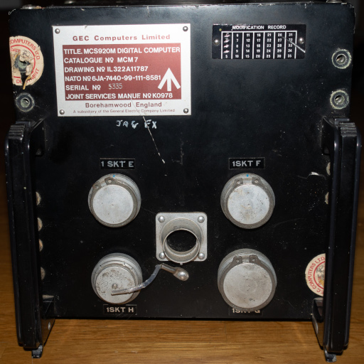

# Elliott (GEC) 920M

This is the Beige-o-Vision project page for the Elliott 920M.  It's one of the 900-series of 18 and 12-bit small computers manufactured from the 1960s by the British computer company Elliott Brothers. The 920M is an 18-bit family member. It's compatible with other 920 series members and the 903. This was physically the smallest member of the family. It implemented the full architecture in an aerospace friendly package. Considering the 903 was the height of a bar and about as wide as three kitchen cabinets, this was quite a feat of miniatisation.

Our initial project is simply to pull together the available information here, and evaluate the system we acquired. We can then make a plan as to what more can be done with it. There are a number of possibilities. 

- **Working system**
  The most adventurous would be making it a functional minicomputer. One adventurous owner, Dr. Erik Baigar, already achieved this. His is also the [reference site](http://www.programmer-electronic-control.de/index.html#BIGBROTHER) for publically available information on the system.  You can see his system and his project here: (https://www.youtube.com/watch?v=v-gF5g0nnoE)
- **Parts donor**
  There are a number of other restoration attempts happening at present. The only known parts source for these machines... is other machines.
- **Static documentation source** 
  There are no public documents on the system circuitry. A tracing project would be useful for the small user community.
- **Basis for a video**
  Naturally, some kind of Beige-o-Vision video will be in the works, but we won't be attempting to duplicate the valuable work of Dr. Erik Baigar. 
- **Office Ornament**
  Well naturally we wanna keep it where we can look at it!

