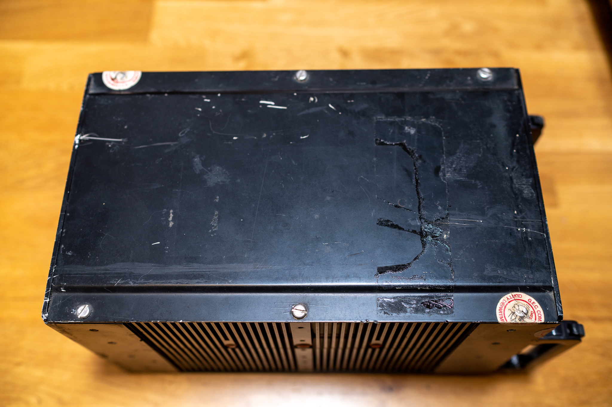
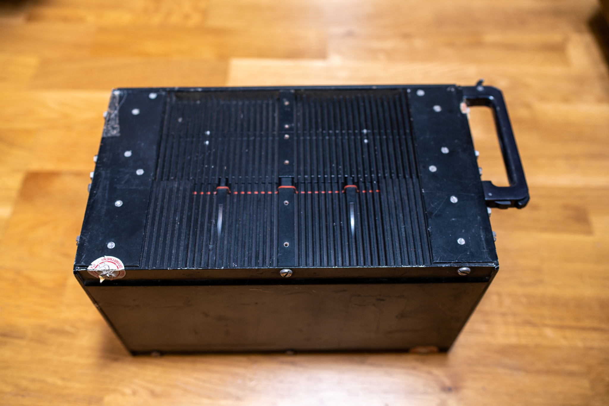
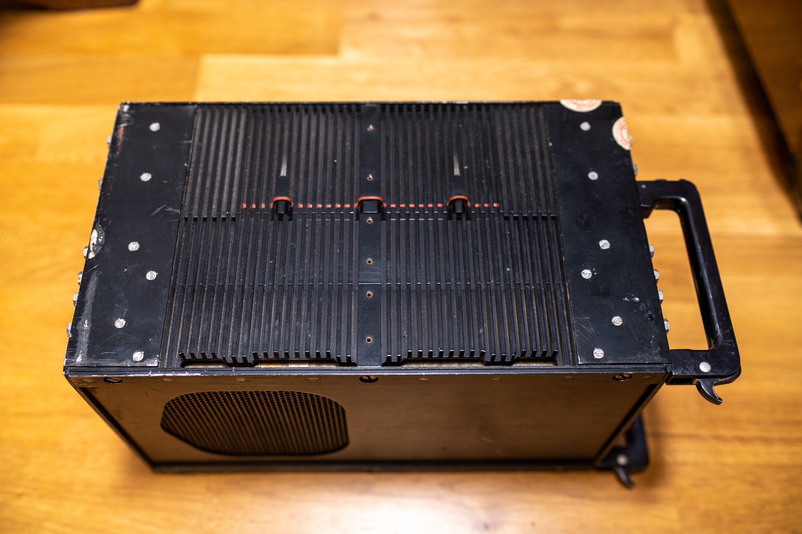
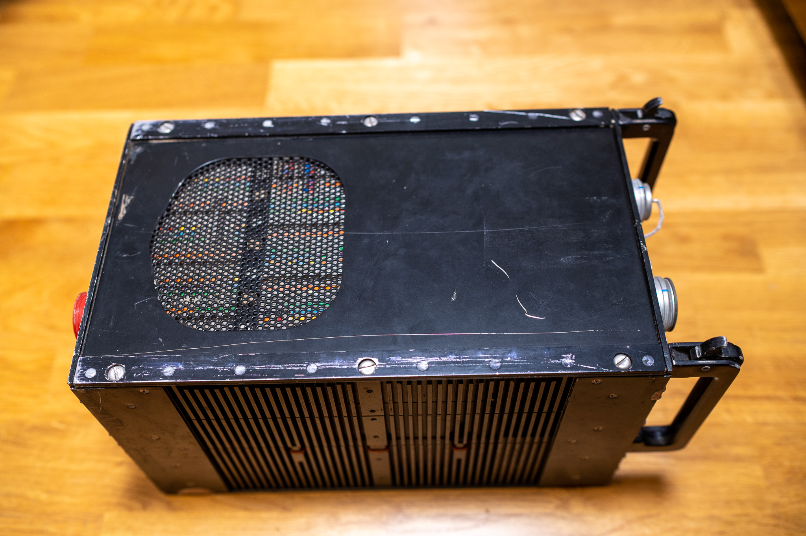
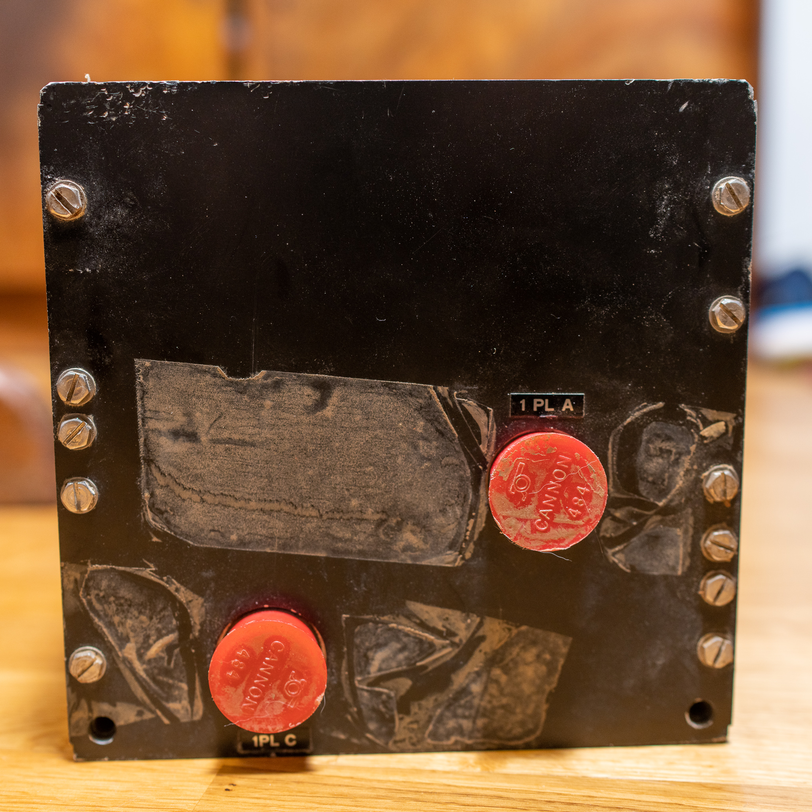
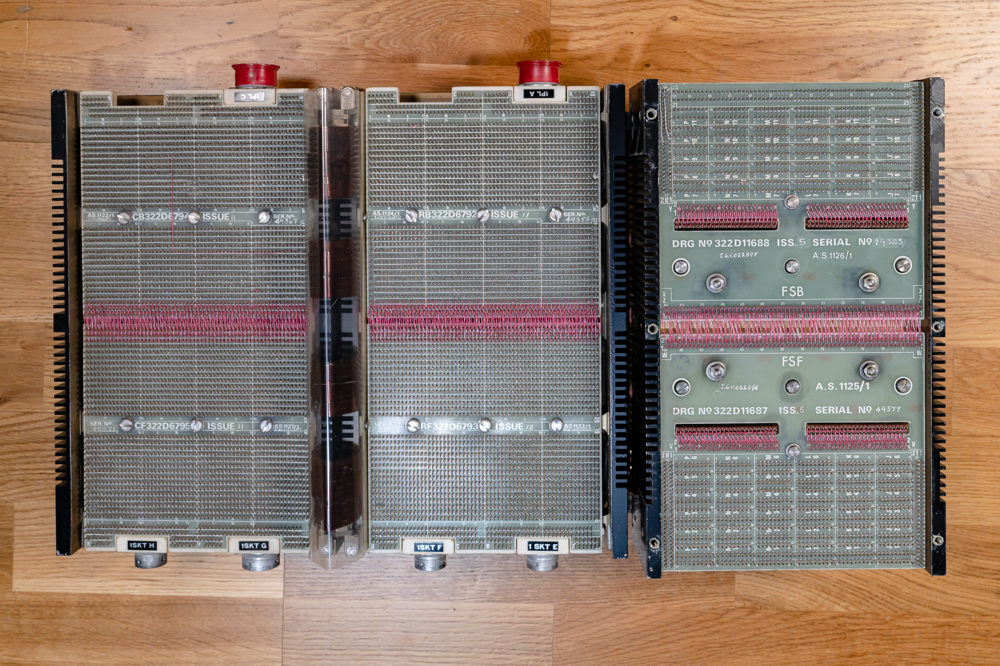

# Notes

## First Impressions
- it's smaller than you'd think
- it's a solid mass - no rattles or squeaks and it has balanced centre of gravity
- while it is in three sections, the memory section is roughly twice as thick as the logic sections -- so it's sort of a four layer cake

## Markings
- paint pen written on the face plate 'JAG EX'
- The model tag reads:
  GEC Computers Limited
  TITLE. MCS920M DIGITAL COMPUTER
  CATALOGUE No MCM7
  DRAWING No IL322A11787
  NATO No 6JA-7440-99-111-8581
  SERIAL No 5335
  JOINT SERVICES MANUF. No K0978
  Borehamwood England
  A subsidiary of the General Electic Company Limited
- Four GEC Computers Ltd. Quality Department service seals:
  - Face plate top left: This appears to be from 1980. It was intact before disassembly
  - Face plate bottom right: 
  - Top plate bottom left
  - Top plate top right
- Modification plate shows ticks for modifications up to 4
  
 

## Other

- All 4 interface caps are present. E, F, G have their cap locking circlips in place
- Rear interface sockets A and C have plastic service caps in place which shows adhesive residue indicating they had once been secured with tape.
- The item had been in a heavy box with firm foam packing.  This had no markings on it and wasn't preserved. 

 

## Visual Condition

- Tape residue on top plate
- Tape residue on back plate
- Wear on loading rails
- Scratches on all sides
- Internally, there's fine dust bound to the surface of components toward one corner of the layout.
- Generally not immediate condition concerns -- though it should be vacuumed out.

 

## Conclusions

- No obvious problems or issues with the system.  
- Candidate of adapting for use.

# Photos

## Face Plate

  

## Top

  

## Right

  

## Left

  

## Bottom

  

## Rear

  

## Internals -- Component Side

High Resolution version available here: [Full Size](img/E920M-Component%20Side-Large.jpg)

 
  

## Internals -- Backplane Side

High Resolution version available here: [Full Size](img/E920M-Backplane-Large.jpg)

 

