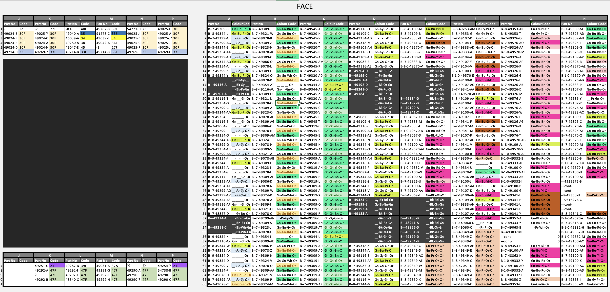

# Module Map

[Link to Spreadsheet of Modules](component-catalogue.xlsx)

# Module Types

- **30F**	Sense Amplifier	Tends to fail short
- **33F**	Filter Module	
  *"Most important single point of failure have been the capacitors for Vcore in the 33F modules whose schematic is very simple. I will unwrap the pins 8,9 on all these modules and connect external capacitors (100uF) on the mainboard to eliminate these completely (ref. [Dr Erik Baigar's Log](http://www.baigar.de/TornadoComputerUnit/TimeLine.html#20190902))
  - Schematic  (ref. [Dr Erik Baigar](http://www.baigar.de/TornadoComputerUnit/33F.gif))
- **__-Pu-Gy-Or**	Resistor Pack 6x 10Kohm	
- **__-Pu-__-Or**	Resistor Pack 5x 120ohm	
- **Gr-Bk-Yl-Or**	? Related to power good	
- **Gr-Bu-Gr-Or**	Dual 4-input NAND gates/drivers	DTL 932 d
- **Gr-Pu-Or-Or**	Dual line driver	"24 x  sending outputs to the paper tape station on socket H and to the real-world (Jaguar) interface on plug C."

# References

- [Erik Baigar Logic Module Recovery Img 1](http://www.baigar.de/TornadoComputerUnit/920M-5328-LogicModuleRecovery.jpg)		
- [Erik Baigar Logic Module Recovery Img 2](http://www.baigar.de/TornadoComputerUnit/920M-LogicModule.JPG)
- [Erik Baigar Memory Module Recovery Img 1](http://www.baigar.de/TornadoComputerUnit/920M-5328-CoreModuleRecovery.jpg)		
- [Erik Baigar Memory Module Recovery Img 2](http://www.baigar.de/TornadoComputerUnit/920M-CoreLayout.gif)